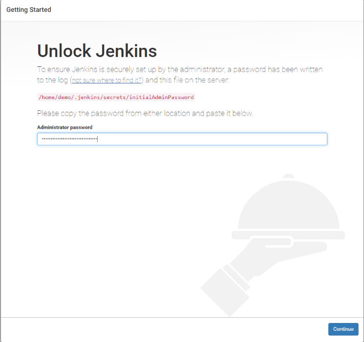
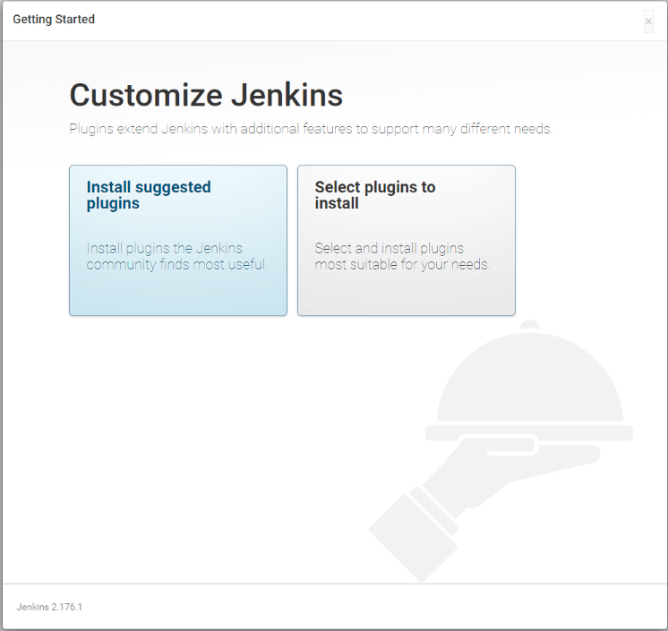
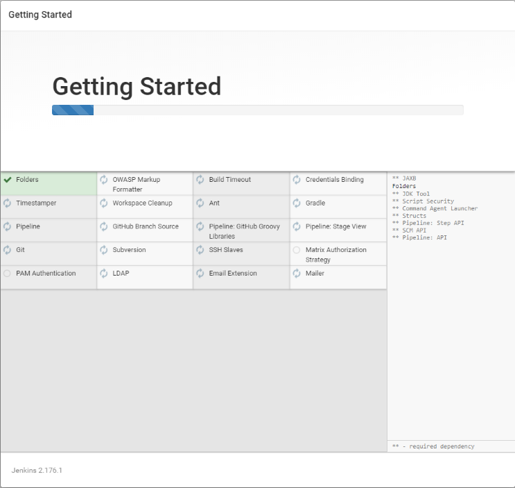
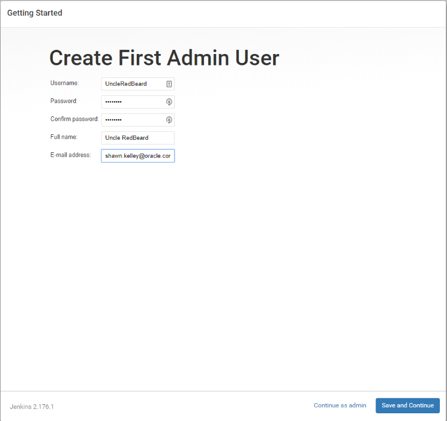
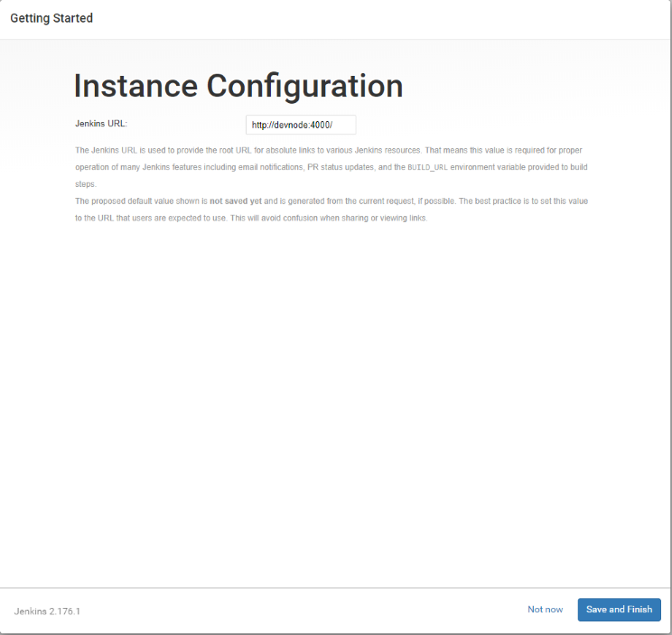
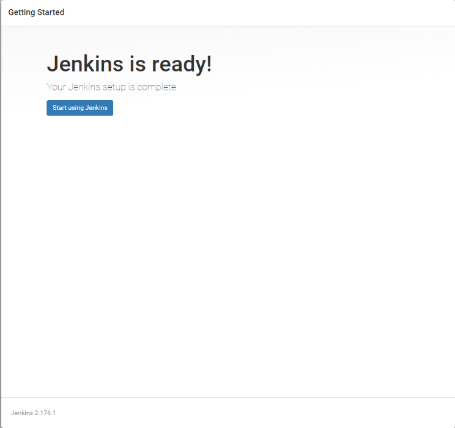

Configuring the Demo Environment
================================

## Assumptions

1. You are using the [full-stack-cncf-demo vagrant](https://olsc-devops.github.io/full-stack-cncf-demo/) setup
2. You have added hosts `192.168.56.200, 192.168.56.201, 192.168.56.202` in `/etc/hosts` as `devnode`, `kmaster`, and `kworker1` to your _**local hosts**_ file (i.e.):

```bash
192.168.56.200  devnode.lab.net     devnode
192.168.56.201  kmaster.lab.net     kmaster
192.168.56.202  kworker1.lab.net    kworker1
```

**NOTE:** If you are on a Windows machine and are having difficulty updating your `hosts` file, please see the [TroubleShooting](TROUBLESHOOTING.md) guide for how to resolve this.

Setting up Jenkins CI/CD
========================

You will probably have missed the password messages when building the vagrant infrastructure. You can get this from

`/home/demo/.jenkins/secrets/initialAdminPassword`

Go to the URL on devnode http://devnode:4000 and enter that.



Next click on "_Install Suggested Plugins_"



...and wait a while



You will end up at "_Create First Admin User_" page. Fill out the information and click "Save and Continue"



Once completed, you should end up at "_Instance Configuration_". Ensure you don't have `localhost` as the hostname, but a proper hostname. Hopefully you would have taken heed at the begining of this document and added the host `devnode` in your hosts file and/or dns so you can get to this machine by name. Click "_Save and Finish_"



Next click "_Stat using Jenkins_"



Now that you are in, click on

 `"Manage Jenkins" -> "Manage Plugins" -> "Check Now"` and wait to complete

Next click on the "_Available_" tab and then seach for Kubernetes in the "Filter" box. Check the "_Kubernetes_" plugin and select "_Install without restart_" button. Next add the "_docker-build-step_" plugin the same way as above.

Next go to main dashboard and click on "_New Item_" on the top left. Enter "_Item Name_" as `cncfdemo` and click "_Pipeline_" and "_OK_" at the bottom. You will open in a config page for this pipeline.
Set the following fields:

* Description: **The CNCF demo**
* Build Triggers:
  * Check **Trigger build remotely**, and then choose a random auth token, perhaps "_**cncfdemotoken**_" but must match the value in the post-commit trigger script below
* Pipeline -> Definintion: **Choose Pipeline from SCM**
* Pipeline -> SCM (Source code management): **git**
* Pipeline -> Repositories: **devnode:git/cncfdemo**
* Pipeline -> Script Path: **Jenkinsfile**

Next set up webhook access. 

`"Manage Jenkins" -> "Configure Global Security" and check "Authorization" -> "Allow anonymous read access"` and apply and save

Click `save`.

Next, login as the `demo` user on devnode (if you haven't already)

`ssh -i id_rsa demo@devenode`

create a file under `~/git/cncfdemo/hooks/post-receive` with the following:

```
#!/bin/sh
curl http://devnode:4000/job/cncfdemo/build?token=cncfdemotoken
```

Make it _**executable**_ and now whenever you do a commit to the repo, a build will trigger for you. Test by using an editor of your choice and commit your change to the repo (devnode:git/cncfdemo) and a build will automatically trigger.

**NOTE:** You can run the script manually or click on your _job -> Build Now_ in the Jenkins web interface. You should get a successful build completion.

Running the First Build
-----------------------

On your host machine,

Pull the bbc app in your home dir

`git clone https://github.com/olsc-devops/bbc`

Since we will be running this repo as a local disconnected demo we need to switch from the remote to the git repo on devnode. So we
remove all past commits and set up our repo

     cd bbc
     rm -rf .git
     git init
     git remote add origin demo@devnode:git/cncfdemo

Set up our userid and email so we know who is interacting with the local repo. You can choose anything you like here (no emails or user
names are leaked)

    git config --global user.email "demo@oracle.com"
    git config --global user.name "CNCF Demo"

Now add a .gitignore and push everything else to our local repo

    printf 'README.md\nnode_modules\npackage-lock.json\n.gitignore' >.gitignore
    git add .
    git commit -a -m 'Initial commit'
    git push -u origin master

Optional step: Set up docker builder URL (optional for freestyle projects)
--------------------------------------------------------------------------

`"Manage Jenkins" -> "Configure System" -> "Docker Builder" -> "URL"` and set it to `"unix:///var/run/docker.sock"` (click test connection, and the save and apply)

Now you can build your docker images (grafana, prometheus etc) using the gui.


Kubernetes dasboard
-------------------

To get to the kubernetes dashboard on kmaster, you would need to first get the login token. On devnode please run

`kubectl -n kube-system describe $(kubectl -n kube-system get secret -n kube-system -o name | grep namespace) | grep token:`

Now browse to the link

      http://localhost:8001/api/v1/namespaces/kube-system/services/https:kubernetes-dashboard:/proxy/#!/login

and use the token from above

**You are all set up now to do the whole demo**

Autoscaling (a.k.a HPA - Horizontal Pod Autoscaling)
----------------------------------------------------

The metrics server has been added to kubernetes cluster and you can display your node metrics running the following on devnode

`$ kubectl descibe no`

and look at the **Allocated resources:** section. Assuming your deployment has been deployed using Jenkins or manually you should be able to now autoscale using

`$ kubectl autoscale deploy cncfdemo --min=1 --max=5`

Check with

`$ kubectl get hpa`

Run some load and you will see the pods counts go up and even kick off on the master node which is untainted.
