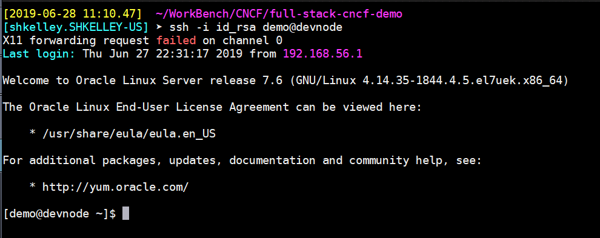

Running the First Build
-----------------------

Login as `demo` to the `devnode`

Clone the bbc app in your home dir

`git clone https://github.com/olsc-devops/bbc`

Next we will add the bbc repository to the git repo on devnode. First, we remove all past commits and set up our repo.

     cd bbc
     rm -rf .git
     git init
     git remote add origin demo@devnode:git/cncfdemo

 

Set up our userid and email so we know who is interacting with the local repo. You can choose anything you like here (no emails or user
names are leaked)

    git config --global user.email "demo@oracle.com"
    git config --global user.name "CNCF Demo"

Now add a .gitignore and push everything else to our local repo

    printf 'README.md\nnode_modules\npackage-lock.json\n.gitignore' >.gitignore
    git add .
    git commit -a -m 'Initial commit'
    git push -u origin master