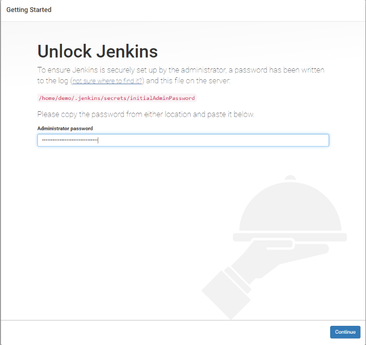
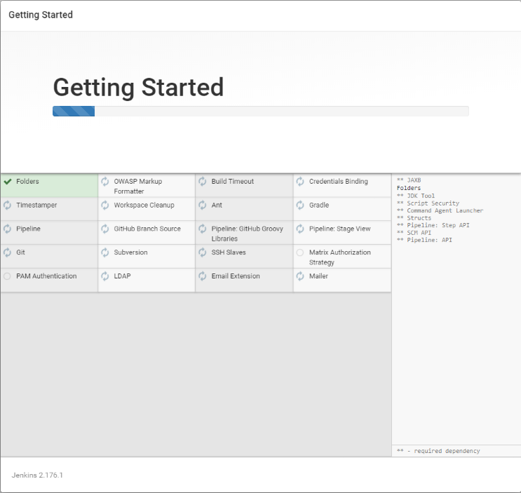
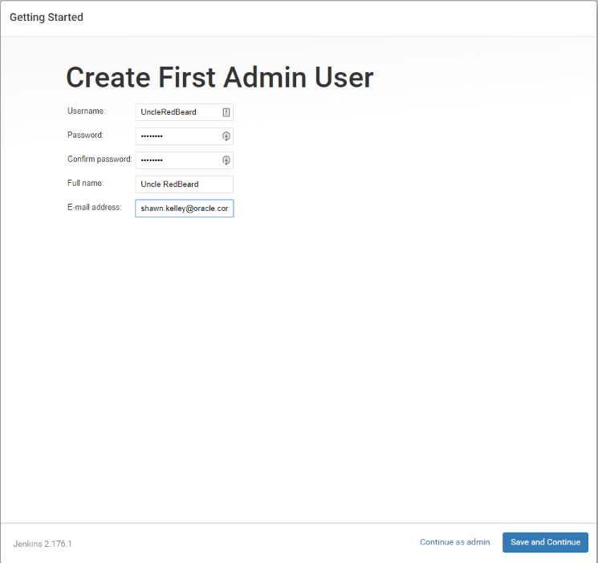
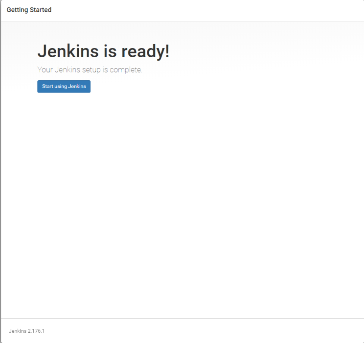
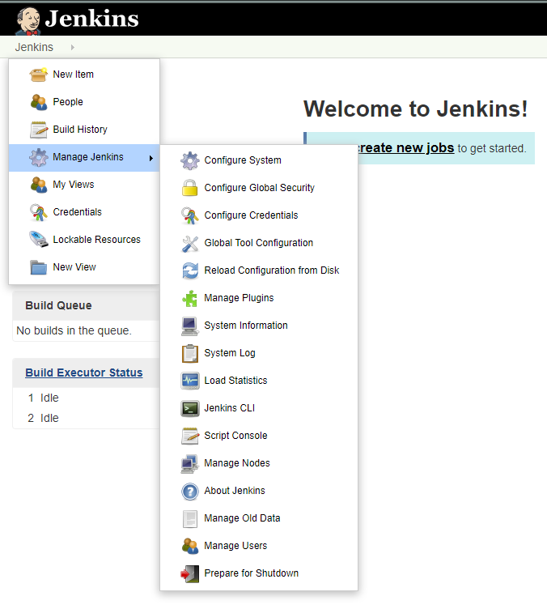

Configuring the Demo Environment
================================

## Assumptions

1. You are using the [full-stack-cncf-demo vagrant](https://olsc-devops.github.io/full-stack-cncf-demo/) setup
2. You have added hosts `192.168.56.200, 192.168.56.201, 192.168.56.202` in `/etc/hosts` as `devnode`, `kmaster`, and `kworker1` to your _**local hosts**_ file (i.e.):

```bash
192.168.56.200  devnode.lab.net     devnode
192.168.56.201  kmaster.lab.net     kmaster
192.168.56.202  kworker1.lab.net    kworker1
```

**NOTE:** If you are on a Windows machine and are having difficulty updating your `hosts` file, please see the [TroubleShooting](TROUBLESHOOTING.md) guide for how to resolve this.

Setting up Jenkins CI/CD
========================

You will probably have missed the password messages when building the vagrant infrastructure. You can get this from

`/home/demo/.jenkins/secrets/initialAdminPassword`

Go to the URL on devnode http://devnode:4000 and enter in the **Administrator Password** box. Then click **Continue**



Next click on **Install Suggested Plugins**


...and wait a while



You will end up at **Create First Admin User** page. Fill out the information and click **Save and Continue**



Once completed, you should end up at **Instance Configuration**. Ensure you don't have `localhost` as the hostname, but a proper hostname. Hopefully you would have taken heed at the begining of this document and added the host `devnode` in your hosts file and/or dns so you can get to this machine by name. Click **Save and Finish**


Next click **Start using Jenkins**



Now that you are in, click on **Manage Jenkins -> Manage Plugins -> Check Now**



and wait to complete


Next click on the **Available** tab and then seach for **_Kubernetes_** in the **Filter** box. Check the **Kubernetes** plugin and select **Install without restart** button. 


...and wait for it to complete


Next add the **_docker-build-step_** plugin the same way as above.


...and wait for it to complete


Next go to main dashboard and click on **New Item** on the top left. 


Enter **Item Name** as `cncfdemo` and click **Pipeline** and **OK** at the bottom. You will open in a config page for this pipeline.


Set the following fields:

* Description: **The CNCF demo**
* Build Triggers:
  * Check **Trigger build remotely**, and then choose a random auth token, perhaps **"cncfdemotoken"** but must match the value in the post-commit trigger script below


* Pipeline -> Definintion: **Choose Pipeline from SCM**


* Pipeline -> SCM (Source code management): **git**


* Pipeline -> Repositories: **devnode:git/cncfdemo**
* Pipeline -> Script Path: **Jenkinsfile**


Next set up webhook access. 

**Manage Jenkins -> Configure Global Security** and check **Authorization -> "Allow anonymous read access**


and **Apply and Save**


Next, login as the `demo` user on devnode (if you haven't already)


Create a file under `~/git/cncfdemo/hooks/post-receive` with the following:

Make it _**executable**_ and now whenever you do a commit to the repo, a build will trigger for you.


**NOTE:** We will walk through the first demo application build later. You can jump ahead to start to those steps in the [First Jenkins Build](FIRSTJENKINSBUILD.md)

Optional step: Set up docker builder URL (optional for freestyle projects)
--------------------------------------------------------------------------

`"Manage Jenkins" -> "Configure System" -> "Docker Builder" -> "URL"` and set it to `"unix:///var/run/docker.sock"` (click test connection, and the save and apply)

Now you can build your docker images (grafana, prometheus etc) using the gui.


Kubernetes dasboard
-------------------

To get to the kubernetes dashboard on kmaster, you would need to first get the login token. On devnode please run

`kubectl -n kube-system describe $(kubectl -n kube-system get secret -n kube-system -o name | grep namespace) | grep token:`

Now browse to the link

      http://localhost:8001/api/v1/namespaces/kube-system/services/https:kubernetes-dashboard:/proxy/#!/login

and use the token from above

Autoscaling (a.k.a HPA - Horizontal Pod Autoscaling)
----------------------------------------------------

The metrics server has been added to kubernetes cluster and you can display your node metrics running the following on devnode

`$ kubectl descibe no`

and look at the **Allocated resources:** section. Assuming your deployment has been deployed using Jenkins or manually you should be able to now autoscale using

`$ kubectl autoscale deploy cncfdemo --min=1 --max=5`

Check with

`$ kubectl get hpa`

Run some load and you will see the pods counts go up and even kick off on the master node which is untainted.

Next Steps
----------

* [Running your first Jenkins build](FIRSTJENKINSBUILD.md)